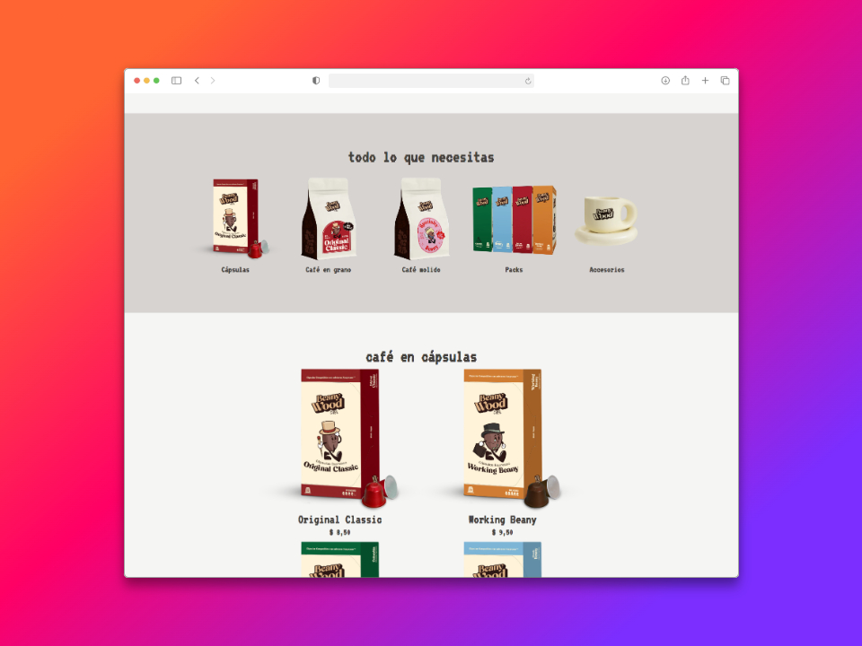
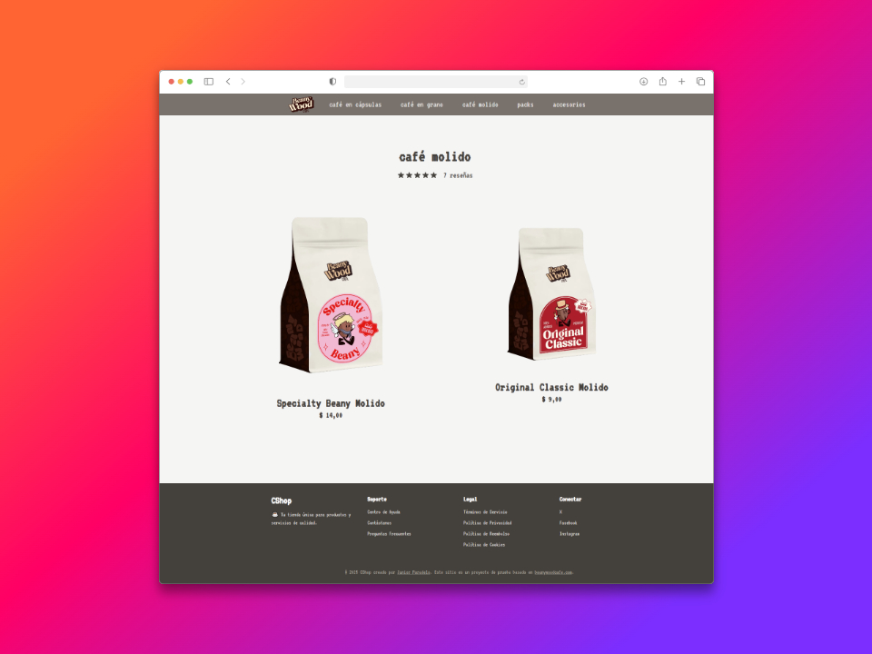
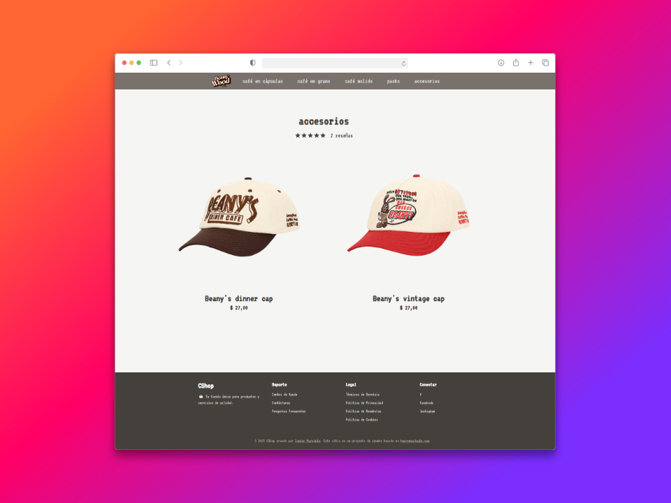
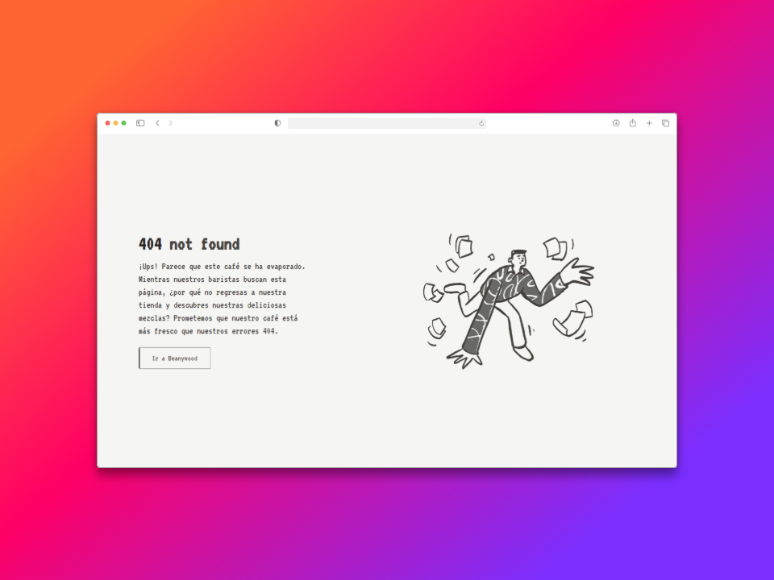

# ☕ cshop: tu tienda de café online

El proyecto fue creado con fines educativos y de práctica con tecnologías modernas de desarrollo web.

## 🌟 Características

- 🚀 Aplicación de página única (SPA) para una navegación fluida
- ✨ Animaciones elegantes utilizando TailwindCSS
- 📱 Diseño totalmente responsive para todos los dispositivos
- 🇪🇸 Contenido completamente en castellano

## 📸 Capturas de Pantalla






## 🛒 Secciones del Sitio

- **Café en Cápsulas**: Variedad de cápsulas compatibles con diferentes máquinas
- **Café en Grano**: Selección premium de granos de diferentes orígenes
- **Café Molido**: Para los amantes del café tradicional
- **Packs**: Combinaciones especiales para regalo o degustación
- **Accesorios**: Todo lo que necesitas para disfrutar de tu café

## 🛠️ Tecnologías Utilizadas

- 🌌 [Astro](https://astro.build) (`^5.3.0`): Framework web moderno y rápido para construir sitios estáticos y dinámicos.
- ⚛️ [React](https://reactjs.org) (`^19.0.0`): Biblioteca de JavaScript para construir interfaces de usuario.
- 🖼️ [ReactDOM](https://reactjs.org/docs/react-dom.html) (`^19.0.0`): Biblioteca para manejar el renderizado de React en el DOM.
- 🎨 [TailwindCSS](https://tailwindcss.com) (`^4.0.4`): Framework de CSS para un diseño rápido y estilizado.
- 🔗 [@astrojs/react](https://docs.astro.build/en/guides/integrations-guide/react/) (`^4.2.0`): Integración de React con Astro para usar componentes de React en proyectos Astro.
- 🖋️ [@fontsource/vt323](https://fontsource.org/fonts/vt323) (`^5.2.5`): Fuente tipográfica VT323 para estilizar el texto del proyecto.
- ⚡ [@tailwindcss/vite](https://tailwindcss.com/docs/installation) (`^4.0.4`): Plugin para integrar TailwindCSS con Vite.
- 🛡️ [@types/react](https://www.npmjs.com/package/@types/react) (`^19.0.8`): Tipos de TypeScript para React.
- 🛡️ [@types/react-dom](https://www.npmjs.com/package/@types/react-dom) (`^19.0.3`): Tipos de TypeScript para ReactDOM.

## 📂 Estructura del Proyecto

```plaintext
📦 cshop
├── 📂 public
├── 📂 src
│   ├── 📂 components       # Componentes reutilizables de la aplicación
│   ├── 📂 layouts          # Diseños generales para las páginas
│   ├── 📂 pages            # Páginas principales del sitio
│   └── 📂 styles           # Archivos de estilos
│       └── 📄 global.css   # Estilos globales del proyecto
├── 📄 astro.config.mjs     # Configuración principal de Astro
├── 📄 tsconfig.json        # Configuración del compilador de TypeScript
└── 📄 package.json         # Dependencias y scripts del proyecto
```

## 🚀 Instalación y Ejecución Local

### Prerrequisitos
- Tener instalado [node.js](https://nodejs.org/) (versión 18 o superior)
- Tener instalado [pnpm](https://pnpm.io/installation)

### Pasos para ejecutar el proyecto

1. **Clonar el repositorio**
    ```bash
    git clone https://github.com/junior-paradelo/cshop.git
    cd cshop
    ```

2. **Instalar dependencias**
    ```bash
    pnpm install
    ```

3. **Ejecutar en modo desarrollo**
    ```bash
    pnpm dev
    ```
    El proyecto estará disponible en `http://localhost:4321`

4. **Compilar para producción**
    ```bash
    pnpm build
    ```

5. **Vista previa de la compilación**
    ```bash
    pnpm preview
    ```

## 👨‍💻 Desarrollo

Este proyecto es una recreación de la web de [beanywoodcafe.com](https://beanywoodcafe.com) desarrollado como un proyecto personal para practicar y mejorar mis habilidades en desarrollo frontend utilizando tecnologías modernas. El proyecto está en desarrollo activo.
